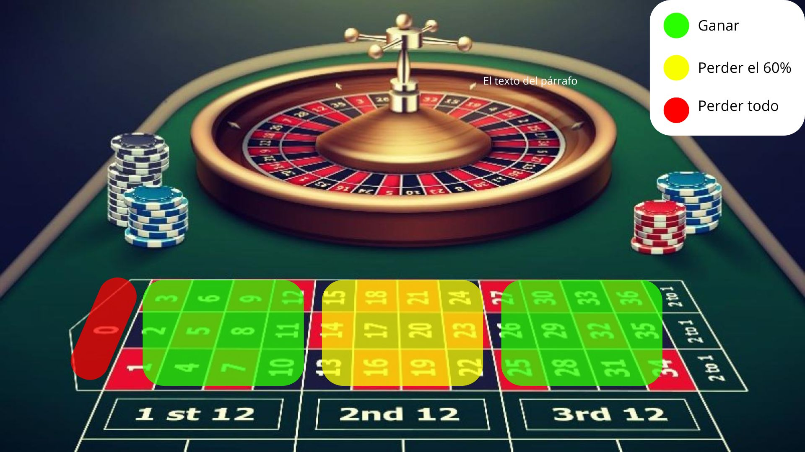

# La Ruleta
La ruleta es un juego de azar icónico en los casinos, conocido tanto por su simplicidad como por su capacidad de ofrecer emocionantes ganancias.Su diseño consta de un disco giratorio dividido en casillas numeradas y de diferentes colores, junto con una bola que gira en sentido opuesto. El número y color en el que se detenga la bola determinan el resultado del juego.

En la ruleta, los jugadores colocan fichas en la mesa para apostar en función de sus predicciones sobre el resultado del giro. Existen diferentes tipos de apuestas, clasificadas en apuestas internas y apuestas externas, cada una con sus propias probabilidades y pagos.

## Tipos de Ruleta
* **Ruleta Europea**: Consta de 37 casillas numeradas del 0 al 36. La casilla "0" es v erde, mientras que las demás se alternan entre rojo y negro.
* **Ruleta Americana**: Similar a la europea, pero incluye una casilla adicional, el "00", lo que eleva el total a 38 casillas.


1. **Apuestas Internas**
Estas apuestas se colocan directamente en los números individuales o en combinaciones específicas dentro del área numerada de la mesa. Ofrecen pagos altos, pero tienen menor probabilidad de éxito:
* Pleno (Straight-Up): Apostar a un solo número. Pago: 35 a 1.
* Dividida (Split): Apostar a dos números adyacentes. Pago: 17 a 1.
* Calle (Street): Apostar a tres números consecutivos en una fila horizontal. Pago: 11 a 1.
* Esquina (Corner): Apostar a cuatro números que forman un cuadrado. Pago: 8 a 1.
* Línea (Line): Apostar a seis números consecutivos en dos filas adyacentes. Pago: 5 a 1.
2. **Apuestas Externas**
Estas apuestas cubren grupos más amplios de números, lo que las hace menos arriesgadas, pero con pagos más bajos:
* Rojo/Negro: Apostar al color del número ganador. Pago: 1 a 1.
* Par/Impar: Apostar a si el número será par o impar. Pago: 1 a 1.
* Alta/Baja: Apostar si el número estará entre 1-18 (bajo) o 19-36 (alto). Pago: 1 a 1.
* Docena: Apostar a uno de los tres grupos de 12 números (1-12, 13-24, 25-36). Pago: 2 a 1.
* Columna: Apostar a una de las tres columnas verticales de números. Pago: 2 a 1.

## La ventaja del Casino
La ventaja del casino proviene de la presencia del cero (0) y, en la ruleta americana, del doble cero (00). 

Por ejenplo, en una apuesta a rojo/negro, hay 18 resultados favorables y 19 resultados desfavorables en la ruleta europea (incluyendo el 0).Esto hace que la probabilidad no sea exactamente 50%, garantizando así que, a largo plazo, el casino tenga una ganancia fija.


Esta ventaja se puede calcular porcentualmente como:

<<<<<<< HEAD

=======
- **Ruleta Europea**:  
  \[
  \text{Ventaja} = \frac{1}{37} \approx 2.7\%
  \]

- **Ruleta Americana**:  
  \[
  \text{Ventaja} = \frac{2}{38} \approx 5.26\%
  \]


# La Ruleta como Distribución Binomial

La ruleta puede modelarse como una distribución binomial en ciertos tipos de apuestas, especialmente en aquellas donde el resultado de cada jugada es un evento con dos resultados posibles: ganar o perder. Esto se puede observar en las apuestas de dinero par, como Rojo/Negro, Par/Impar, y 1-18/19-36. Estas apuestas tienen solo dos resultados posibles (ganar o perder), lo que las hace aptas para modelarse con la distribución binomial.


## Concepto de distribución Binomial
La distribución binomial describe el número de éxitos (eventos favorables) en una secuencia de ensayos independientes, cuando la probabilidad de éxito en cada ensayo es constante. En términos matemáticos, se define como:

\begin{equation} 
  f\left(k\right) = \binom{n}{k} p^k\left(1-p\right)^{n-k} \hspace{1cm} (Ec. 1)
\end{equation}

## Apuestas con distribución binomial
Para una apuesta de dinero par (como Rojo/Negro), el éxito se define como ganar la apuesta, y el fracaso como perderla. Veamos cómo se aplica la distribución binomial:

1. Número de ensayos (n): El número de giros de la ruleta o jugadas que se realizan. 
2. Probabilidad de éxito (p): La probabilidad de que la apuesta salga ganadora en una jugada.

* Para la ruleta europea, la probabilidad de ganar una apuesta en Rojo/Negro es 
$$
P_{\text{ganar}} = \frac{18}{37}
$$
* Para la ruleta americana, la probabilidad de ganar una apuesta en Rojo/Negro es

$$
P_{\text{ganar}} = \frac{18}{38}
$$
  
3. Número de éxitos (X): El número de veces que se gana la apuesta. Esto es lo que queremos modelar y contar.

## Valor Esperado de una apuesta
  El objetivo de jugar a la ruleta es aprovechar el azar para obtener ganancias, lo que en teoría parece una forma "sencilla" de ganar dinero. Sin embargo, antes de jugar, es fundamental analizar cuán rentable es una apuesta desde el punto de vista estadístico. Para esto, calculamos la **ganancia esperada**, una medida que nos indica cuánto dinero podemos ganar o perder, en promedio, por cada apuesta realizada.

El concepto de **valor esperado** se aplica a una variable aleatoria, en este caso, la ganancia obtenida en una apuesta. Para ilustrarlo, tomemos el ejemplo de una apuesta simple como jugar al **rojo/negro** en la ruleta americana.

El valor esperado \( E(X) \) se calcula como:

\[
E(X) = (1) \cdot P(\text{ganar}) + (-1) \cdot P(\text{perder})
\]

Donde:
- \( P(\text{ganar}) = \frac{18}{38} \): probabilidad de ganar.
- \( P(\text{perder}) = \frac{20}{38} \): probabilidad de perder.

Sustituyendo los valores:

\[
E(X) = \frac{18}{38} - \frac{20}{38} = -\frac{2}{38} = -0.0526
\]

En promedio, el jugador pierde aproximadamente 0.0526 unidades por cada apuesta, es decir, el 5.26% de la cantidad apostada. Este resultado refleja la ventaja estadística del casino.

# Estrategia
Si bien en los juegos de azar, como su nombre lo indica la aleatoriedad juega un papel fundamental en el desarrollo del mismo, no hay nada seguro, pues, predecir a ciencia cierta que es lo que va a suceder es casi imposible, pues entre más específico se sea más complicado va ser predecir o adivinar, un ejemplo de esto es la misma ruleta, pues predecir que número va a caer exactamente es mucho más complicado que decir un rango de números más amplio dónde nosotros predecimos que lo más probable es que se encuentre allí; Más, sin embargo, normalmente hay un vacío legal del que se puede aprovechar, en ese caso plantearemos una estrategia para poder, si bien poco, ganar la mayoría de las veces pisables.

## Explicación 
La estrategia consiste en que, sabiendo que la apuesta por docenas multiplica por dos, o sea paga el doble, podemos hacer una 'configuración' en las que nuestras chances de ganar sean él doble que las chances de perder la mitad del dinero y el duodécuplo de perderlo todo.
Si ponemos dos fichas de (puede ser cualquier valor, pero para términos prácticos usaremos de fichas de 100 y 200) 200 en las docenas de los 'extremos' de la mesa, osase en la docena del 1-12 y en la del 25-36 y una de 100 en la docena de la mitad, ósea de 13-24, tenemos la probabilidad del $\frac{24}{37}$ de ganar 100 si cae entre 1-12 o 24-36, un $\frac{12}{37}$ de perder el 60% de mi apuesta inicial si cae entre 13-24 y $\frac{1}{37}$ de perder todo si cae 0.

{width=800 height=400}

## Simulación en R
En esta sección, se describe el proceso de simulación en R, para la estrategia abordada anteriormente.


```{r Simular_estrategia}
docenas <- data.frame(
  Docena1 = 1:12,       
  Docena2 = 13:24,      
  Docena3 = 25:36       
)
semilla <- as.numeric(format(Sys.time(), "%S"))
set.seed(semilla)

simular_estrategia <- function() {
  
  ruleta <- 0:36
  resultado <- sample(ruleta, size = 1)
  
  apuestas <- data.frame(
    docena_1 = 200,
    docena_2 = 100,
    docena_3 = 200
  )
  
  ganancias <- 0
  
  if (resultado %in% docenas$Docena1) {
  
    ganancias <- (apuestas$docena_1 * 2 - 500) + apuestas$docena_1
    
  } else if (resultado %in% docenas$Docena2) {
    
    ganancias <- (apuestas$docena_2 * 2 - 500)  + apuestas$docena_2
    
  } else if (resultado %in% docenas$Docena3) {
    
    ganancias <- (apuestas$docena_3 * 2 - 500) +   apuestas$docena_3
    
  } else {
    
    ganancias <- -500  
  }
  
  return(list(resultado = resultado, ganancias_net = ganancias))
}

simulacion <- simular_estrategia()
print(simulacion)

```


```{r simulacion_rondas}
simular_varios <- function(n) {
  
  juegos <- data.frame(
    resultado = numeric(0), 
    ganancias_net = numeric(0),
    contador = numeric(0))
  
  contador1 <- 0

  for (i in 1:n) {  
    
    contador1 <- contador1 + 1
        
    simulacion <- simular_estrategia()  

    juegos <- rbind(juegos, 
                    data.frame(resultado = simulacion$resultado, 
                        ganancias_net = simulacion$ganancias_net,
                        contador = contador1))
  }
  
  return(juegos)  
}

```

Ahora observemos como se comporta esta estrategia a la larga, ¿a dónde tiende?

```{r EvolucionGananciasInfinito, echo=TRUE, fig.width=8, fig.height=4}
library(ggplot2)

rondas_infinito <- simular_varios(10000)
head(rondas_infinito)

rondas_infinito$GananciasAcumuladas <- cumsum(rondas_infinito$ganancias_net)

ggplot(rondas_infinito, aes(x = contador, y = GananciasAcumuladas)) +
  geom_line(color = "green") +
  labs(title = "Evolución de las Ganancias Acumuladas",
       x = "Número de Rondas",
       y = "Ganancia Acumulada")
```
Como ya no lo advertía el 'Valor Esperado' las ganancias a la larga solo tienden a ir en picada, pues recordemos que este era negativo (-0.0526); Perdemos más de lo que ganamos en el infinito y pues no está mal, es la forma que él tiene el casino para generar la tan alta rentabilidad que tiene; Y en algunos casos podemos perder dinero aunque hayamos ganado más de las que perdimos, ejemplificando esto último.

```{r Proporción_victorias_derrotas, echo=TRUE, fig.width=8, fig.height=4}
rondas_infinito$ResultadoFinal <- ifelse(rondas_infinito$ganancias_net > 0, "Victoria", "Derrota")

ggplot(rondas_infinito, aes(x = ResultadoFinal, fill = ResultadoFinal)) +
  geom_bar() +
  scale_fill_manual(values = c("Victoria" = "green", "Derrota" = "red")) +
  labs(title = "Proporción de Victorias y Derrotas",
       x = "Resultado",
       y = "Número de Rondas")


```
Pero vayamos a un ámbito real, nadie va a hacer 10k juegos en un día, tomemos una persona promedio que disfruta de la emoción que le puedan brindar las apuestas responsablemente, simulemos 10 juegos haciendo uso de la estrategia.

```{r EvolucionGananciasReal, echo=TRUE, fig.width=8, fig.height=4}
rondas_reales <- simular_varios(10)
head(rondas_reales)

rondas_reales$GananciasAcumuladas <- cumsum(rondas_reales$ganancias_net)

ggplot(rondas_reales, aes(x = contador, y = GananciasAcumuladas)) +
  geom_line(color = "green") +
  labs(title = "Evolución de las Ganancias Acumuladas",
       x = "Número de Rondas",
       y = "Ganancia Acumulada")

rondas_reales$ResultadoFinal <- ifelse(rondas_reales$ganancias_net > 0, "Victoria", "Derrota")

ggplot(rondas_reales, aes(x = ResultadoFinal, fill = ResultadoFinal)) +
  geom_bar() +
  scale_fill_manual(values = c("Victoria" = "green", "Derrota" = "red")) +
  labs(title = "Proporción de Victorias y Derrotas",
       x = "Resultado",
       y = "Número de Rondas")

```

Y observamos cosas interesantes, con un poco de suerte podemos obtener ganancias netas considerables, pero; ¿Habrá sido suerte?
Consideremos ahora un promedio de 10 veces 10 rondas; Es decir, imagina que vas 10 días seguidos al casino y haces 10 juegos usando la estrategia, a ver qué resultados podemos obtener

```{r PromedioDiezJuegos1, echo=TRUE, fig.width=8, fig.height=4}

simular_Diez_Rondas <- function(n) {
  
  rondas_diez <- data.frame(
    resultado = numeric(0), 
    ganancias_net = numeric(0),
    contador = numeric(0)
  )
  
  for (i in 1:n) {
    simulacion <- simular_varios(10)
    
    resultado_promedio <- mean(simulacion$resultado)
    ganancias_net <- sum(simulacion$ganancias_net) 
    
    rondas_diez <- rbind(rondas_diez,
                         data.frame(resultado = resultado_promedio, 
                                    ganancias_net = ganancias_net,
                                    contador = i))
  }
  
  return(rondas_diez)
}


rondas_diez <-simular_Diez_Rondas(10)
head(rondas_diez)

rondas_diez$GananciasAcumuladas <- cumsum(rondas_diez$ganancias_net)

ggplot(rondas_diez, aes(x = contador, y = GananciasAcumuladas)) +
  geom_line(color = "green") +
  labs(title = "Evolución de las Ganancias Acumuladas",
       x = "Número de Rondas",
       y = "Ganancia Acumulada")

rondas_diez$ResultadoFinal <- ifelse(rondas_diez$ganancias_net > 0, "Victoria", "Derrota")

ggplot(rondas_diez, aes(x = ResultadoFinal, fill = ResultadoFinal)) +
  geom_bar() +
  scale_fill_manual(values = c("Victoria" = "green", "Derrota" = "red")) +
  labs(title = "Proporción de Victorias y Derrotas",
       x = "Resultado",
       y = "Número de Rondas")

```

Notamos que vuelven a haber perdida, ¿no se suponía que la estrategia servía para ganar fácil? probemos dos veces más

```{r PromedioDiezJuegos2, echo=FALSE, fig.width=8, fig.height=4}

simular_Diez_Rondas <- function(n) {
  
  rondas_diez <- data.frame(
    resultado = numeric(0), 
    ganancias_net = numeric(0),
    contador = numeric(0)
  )
  
  for (i in 1:n) {
    simulacion <- simular_varios(10)
    
    resultado_promedio <- mean(simulacion$resultado)
    ganancias_net <- sum(simulacion$ganancias_net) 
    
    rondas_diez <- rbind(rondas_diez,
                         data.frame(resultado = resultado_promedio, 
                                    ganancias_net = ganancias_net,
                                    contador = i))
  }
  
  return(rondas_diez)
}


rondas_diez <-simular_Diez_Rondas(10)
head(rondas_diez)

rondas_diez$GananciasAcumuladas <- cumsum(rondas_diez$ganancias_net)

ggplot(rondas_diez, aes(x = contador, y = GananciasAcumuladas)) +
  geom_line(color = "green") +
  labs(title = "Evolución de las Ganancias Acumuladas",
       x = "Número de Rondas",
       y = "Ganancia Acumulada")

rondas_diez$ResultadoFinal <- ifelse(rondas_diez$ganancias_net > 0, "Victoria", "Derrota")

ggplot(rondas_diez, aes(x = ResultadoFinal, fill = ResultadoFinal)) +
  geom_bar() +
  scale_fill_manual(values = c("Victoria" = "green", "Derrota" = "red")) +
  labs(title = "Proporción de Victorias y Derrotas",
       x = "Resultado",
       y = "Número de Rondas")

```

```{r PromedioDiezJuegos3, echo=FALSE, fig.width=8, fig.height=4}

simular_Diez_Rondas <- function(n) {
  
  rondas_diez <- data.frame(
    resultado = numeric(0), 
    ganancias_net = numeric(0),
    contador = numeric(0)
  )
  
  for (i in 1:n) {
    simulacion <- simular_varios(10)
    
    resultado_promedio <- mean(simulacion$resultado)
    ganancias_net <- sum(simulacion$ganancias_net) 
    
    rondas_diez <- rbind(rondas_diez,
                         data.frame(resultado = resultado_promedio, 
                                    ganancias_net = ganancias_net,
                                    contador = i))
  }
  
  return(rondas_diez)
}


rondas_diez <-simular_Diez_Rondas(10)
head(rondas_diez)

rondas_diez$GananciasAcumuladas <- cumsum(rondas_diez$ganancias_net)

ggplot(rondas_diez, aes(x = contador, y = GananciasAcumuladas)) +
  geom_line(color = "green") +
  labs(title = "Evolución de las Ganancias Acumuladas",
       x = "Número de Rondas",
       y = "Ganancia Acumulada")

rondas_diez$ResultadoFinal <- ifelse(rondas_diez$ganancias_net > 0, "Victoria", "Derrota")

ggplot(rondas_diez, aes(x = ResultadoFinal, fill = ResultadoFinal)) +
  geom_bar() +
  scale_fill_manual(values = c("Victoria" = "green", "Derrota" = "red")) +
  labs(title = "Proporción de Victorias y Derrotas",
       x = "Resultado",
       y = "Número de Rondas")

```

# Resultdos
Notemos que el comportamiento en totalmente impredecible, algunas veces aparecen valores favorables y otras veces no, eso sumado a la ventaja que lleva el casino del cero, se hace totalmente imposible ganar de manera repetida en la ruleta.
¿Entonces esto significa que la estrategia realmente no aporta? Pues no del todo, si bien ya concluimos que es complicado ganar repetidas veces, la estrategia nos ayuda a reducir pérdida en las situaciones desfavorables, aparte de que observando las gráficas nos podríamos atrever a decir que: Una, si el juego comienza mal en los primeros 3 intentos, hay que retirarse y Dos, si las ganancias comienzan a caer después de haber tenido una larga racha, también es momento de retirarse.
Más, sin embargo, en cualquier caso, gracias a los resultados, concluimos que no hay que esperar mucho de este juego, puede haber muchas estrategias sutiles y muy buenas, pero la aleatoriedad siempre nos jugara en contra, úsala y diviértete sin expectativa alguna de esperar algo a cambio y no uses dinero importante, si es la colegiatura de los niños, mejor guardársela.


