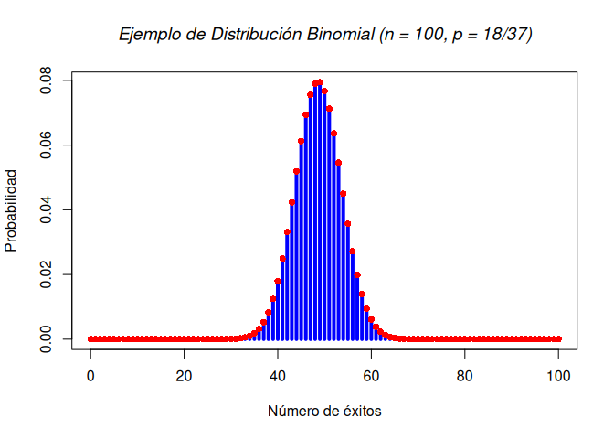
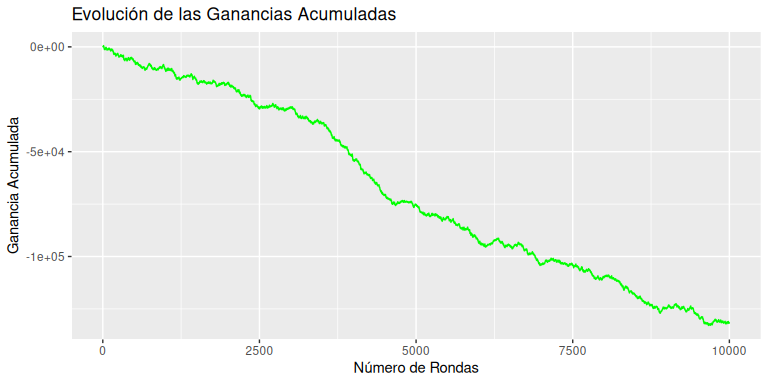
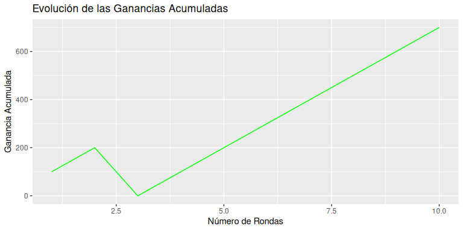
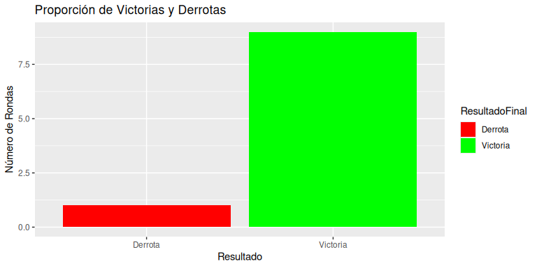
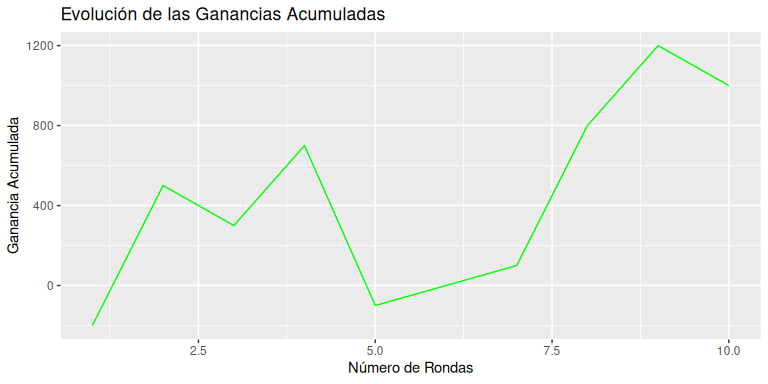
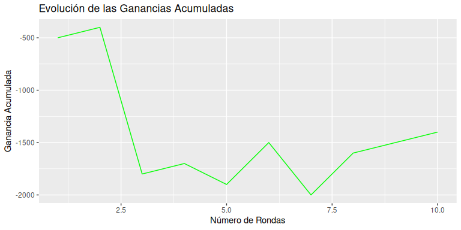
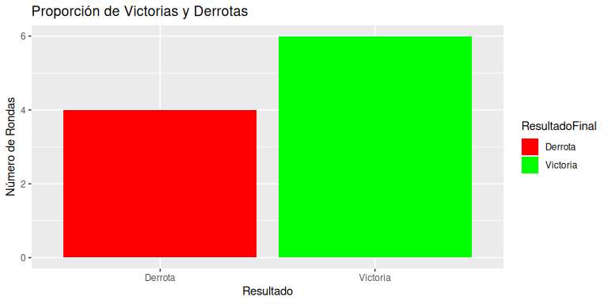
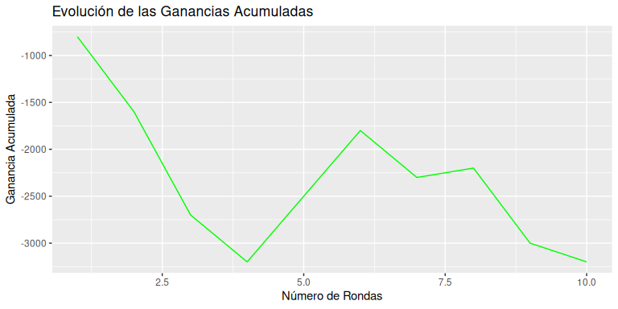
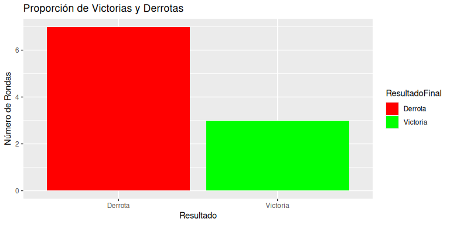

# Introducción
## La Ruleta
La ruleta es un juego de azar icónico en los casinos, conocido tanto por su simplicidad como por su capacidad de ofrecer emocionantes ganancias. Su diseño consta de un disco giratorio dividido en casillas numeradas y de diferentes colores, junto con una bola que gira en sentido opuesto a la dirección de giro de la ruleta. El número y color en el que se detenga la bola determinan el resultado del juego.

<center>{width=300 height=300}

_**Fuente**: [@imagen1]_</center>

En la ruleta, los jugadores colocan fichas en la mesa para apostar en función de sus predicciones sobre el resultado del giro. Existen diferentes tipos de apuestas, las cuales se clasifican en apuestas internas y apuestas externas, cada una con sus probabilidades y pagos correspondientes.

### Tipos de Ruleta
* **Ruleta Europea**: Consta de 37 casillas numeradas del 0 al 36. La casilla <span style="color: green;">"0"</span> es verde, mientras que las demás se alternan entre <span style="color:red;">**rojo**</span> y **negro**.
* **Ruleta Americana**: Similar a la europea, pero incluye una casilla adicional, el "00", lo que eleva el total a 38 casillas.
<center>{width=600 height=350}


_**Fuente**: [@imagen2]_</center>

1. **Apuestas Internas**
Estas apuestas se colocan directamente en los números individuales o en combinaciones específicas dentro del área numerada de la mesa. Ofrecen pagos altos, pero tienen menor probabilidad de éxito:
* Pleno (Straight-Up): Apostar a un solo número. Pago: 35 a 1.
* Dividida (Split): Apostar a dos números adyacentes. Pago: 17 a 1.
* Calle (Street): Apostar a tres números consecutivos en una fila horizontal. Pago: 11 a 1.
* Esquina (Corner): Apostar a cuatro números que forman un cuadrado. Pago: 8 a 1.
* Línea (Line): Apostar a seis números consecutivos en dos filas adyacentes. Pago: 5 a 1.
2. **Apuestas Externas**
Estas apuestas cubren grupos más amplios de números, lo que las hace menos arriesgadas, pero con pagos más bajos:
* <span style="color:red;">**rojo**</span>/**negro**: Apostar al color del número ganador. Pago: 1 a 1.
* Par/Impar: Apostar a si el número será par o impar. Pago: 1 a 1.
* Alta/Baja: Apostar si el número estará entre 1-18 (bajo) o 19-36 (alto). Pago: 1 a 1.
* Docena: Apostar a uno de los tres grupos de 12 números (1-12, 13-24, 25-36). Pago: 2 a 1.
* Columna: Apostar a una de las tres columnas verticales de números. Pago: 2 a 1.

<center>{width=600 height=500}

_**Fuente**: [@imagen3]_</center>

### La ventaja del Casino
La ventaja del casino proviene de la presencia del cero <span style="color: green;">(0)</span> y, en la ruleta americana, también del doble cero <span style="color: green;">(00)</span>. 

Por ejemplo, en una apuesta a <span style="color:red;">**rojo**</span>/**negro**, hay 18 resultados favorables y 19 resultados desfavorables en la ruleta europea (incluyendo el <span style="color: green;">0</span>).Esto hace que la probabilidad no sea exactamente 50%, garantizando así que, a largo plazo, el casino tenga una ganancia fija.


Esta ventaja se puede calcular porcentualmente como:

- **Ruleta Europea**:  
  \[
  \text{Ventaja} = \frac{1}{37} \approx 2.7\%
  \]

- **Ruleta Americana**:  
  \[
  \text{Ventaja} = \frac{2}{38} \approx 5.26\%
  \]

# Metodología
## La Ruleta como Distribución Binomial

La ruleta puede modelarse como una distribución binomial en ciertos tipos de apuestas, especialmente en aquellas donde el resultado de cada jugada es un evento con dos resultados posibles: ganar o perder. Esto se puede observar en las apuestas de dinero par, como <span style="color:red;">**rojo**</span>/**negro**, Par/Impar, y 1-18/19-36. Estas apuestas tienen solo dos resultados posibles (ganar o perder), lo que las hace aptas para modelarse con la distribución binomial.

<!-- -->

### Concepto de distribución Binomial
La distribución binomial describe el número de éxitos (eventos favorables) en una secuencia de ensayos independientes, cuando la probabilidad de éxito en cada ensayo es constante. En términos matemáticos, se define como:

\begin{equation} 
  f\left(k\right) = \binom{n}{k} p^k\left(1-p\right)^{n-k} \hspace{1cm} (Ec. 1)
\end{equation}

## Apuestas con distribución binomial
Para una apuesta de dinero par (como <span style="color:red;">**rojo**</span>/**negro**), el éxito se define como ganar la apuesta, y el fracaso como perderla. Veamos cómo se aplica la distribución binomial:

1. **Número de ensayos (n):** El número de giros de la ruleta o jugadas que se realizan. 
2. **Probabilidad de éxito (p):** La probabilidad de que la apuesta salga ganadora en una jugada.

* Para la ruleta europea, la probabilidad de ganar una apuesta en <span style="color:red;">**rojo**</span>/**negro** es:

$$
P_{\text{ganar}} = \frac{18}{37}
$$

* Para la ruleta americana, la probabilidad de ganar una apuesta en <span style="color:red;">**rojo**</span>/**negro** es:

$$
P_{\text{ganar}} = \frac{18}{38}
$$
  
3. **Número de éxitos (X):** El número de veces que se gana la apuesta. Esto es lo que nos interesa modelar y contar.

## Valor Esperado de una apuesta
  El objetivo principal al jugar a la ruleta es aprovechar el azar para obtener ganancias, lo que en teoría, puede parecer una manera "factible" de ganar dinero. Sin embargo, antes de jugar, es fundamental analizar realmente, cuán rentable es una apuesta desde el punto de vista estadístico. Para esto, se calcula la **ganancia esperada**, una medida que nos indica, en promedio, cuánto dinero podemos ganar o perder por cada apuesta realizada.

El concepto de **valor esperado** se aplica a una variable aleatoria, en este caso, la ganancia obtenida en una apuesta. Para ilustrarlo, consideremos un ejemplo sencillo: realizar apuesta al <span style="color:red;">**rojo**</span>/**negro** en la ruleta americana.

El valor esperado \( E(X) \) se calcula como:

\[
E(X) = (1) \cdot P(\text{ganar}) + (-1) \cdot P(\text{perder})
\]

Donde:
<center>

\( P(\text{ganar}) = \frac{18}{38} \): probabilidad de ganar.

\( P(\text{perder}) = \frac{20}{38} \): probabilidad de perder.

</center>
Sustituyendo los valores:

\[
E(X) = \frac{18}{38} - \frac{20}{38} = -\frac{2}{38} = -0.0526
\]

En promedio, el jugador pierde aproximadamente 0.0526 unidades por cada apuesta, es decir, el 5.26% de la cantidad apostada. Resultado que refleja la ventaja estadística que posee el casino.

## Estrategia
Si bien en los juegos de azar, como su nombre lo indica, la aleatoriedad es un factor fundamental en su desarrollo, no existen certezas absolutas. Predecir a ciencia cierta lo que va a suceder es prácticamente imposible, pues entre más específico sea el evento a predecir, más complicado resultará hacerlo. Un ejemplo de esto es la ruleta: realizar una predicción del número exacto en el que caerá la bola es una hazaña mucho más díficil que predecir un rango de números donde es más probable que caiga. 
Sin embargo, a pesar de la incertidumbre inherente, suele existir un vacío legal ha ser aprovechado. Es así que, plantearemos una estrategia que, aunque no garantice ganancias grandes, permite aumentar las probabilidades de éxito en la mayoría de apuestas.

### Explicación 
La estrategia se basa en aprovechar las apuestas por docenas, cuyo pago es el doble, para configurar una distribución en la que nuestras chances de ganar sean el doble que las de perder la mitad del dinero y el duodécuplo de perderlo todo.
La configuración consiste en colocar dos fichas(pueden ser cualquier valor, pero para términos prácticos usaremos de 100 y 200) en las docenas de los 'extremos' de la mesa: una ficha en la docena del 1-12 y otra en la del 25-36. Luego, ubicamos una de 100 en la docena intermedia, ósea del 13-24, distribuyendo las probabilidades de la siguiente manera:

* <span style="color:green;">**Probablidad de ganar 100:**</span> $\frac{24}{37}$ si la bola cae entre 1-12 o 25-36.

* <span style="color:#b8860b;">**Probabilidad de perder el 60% de la apuesta inicial:**</span> $\frac{12}{37}$ si cae entre 13-24.

* <span style="color:red;">**Probabilidad de perder todo:**</span> $\frac{1}{37}$ si cae 0.

<center>{width=400 height=250}

_**Fuente**: [@imagen4]_</center>

### Simulación en R
En esta sección, se describe el proceso de simulación en R, para la estrategia abordada anteriormente.


``` r
docenas <- data.frame(
  Docena1 = 1:12,       
  Docena2 = 13:24,      
  Docena3 = 25:36       
)
semilla <- as.numeric(format(Sys.time(), "%S"))
set.seed(semilla)

simular_estrategia <- function() {
  
  ruleta <- 0:36
  resultado <- sample(ruleta, size = 1)
  
  apuestas <- data.frame(
    docena_1 = 200,
    docena_2 = 100,
    docena_3 = 200
  )
  
  ganancias <- 0
  
  if (resultado %in% docenas$Docena1) {
  
    ganancias <- (apuestas$docena_1 * 2 - 500) + apuestas$docena_1
    
  } else if (resultado %in% docenas$Docena2) {
    
    ganancias <- (apuestas$docena_2 * 2 - 500)  + apuestas$docena_2
    
  } else if (resultado %in% docenas$Docena3) {
    
    ganancias <- (apuestas$docena_3 * 2 - 500) +   apuestas$docena_3
    
  } else {
    
    ganancias <- -500  
  }
  
  return(list(resultado = resultado, ganancias_net = ganancias))
}

simulacion <- simular_estrategia()
print(simulacion)
```

```
## $resultado
## [1] 32
## 
## $ganancias_net
## [1] 100
```


``` r
simular_varios <- function(n) {
  
  juegos <- data.frame(
    resultado = numeric(0), 
    ganancias_net = numeric(0),
    contador = numeric(0))
  
  contador1 <- 0

  for (i in 1:n) {  
    
    contador1 <- contador1 + 1
        
    simulacion <- simular_estrategia()  

    juegos <- rbind(juegos, 
                    data.frame(resultado = simulacion$resultado, 
                        ganancias_net = simulacion$ganancias_net,
                        contador = contador1))
  }
  
  return(juegos)  
}
```

#Resultados

Ahora observemos como se comporta esta estrategia a la larga, ¿a dónde tiende?


``` r
library(ggplot2)

rondas_infinito <- simular_varios(10000)
head(rondas_infinito)
```

```
##   resultado ganancias_net contador
## 1         2           100        1
## 2        15          -200        2
## 3        20          -200        3
## 4        35           100        4
## 5        29           100        5
## 6         7           100        6
```

``` r
rondas_infinito$GananciasAcumuladas <- cumsum(rondas_infinito$ganancias_net)

ggplot(rondas_infinito, aes(x = contador, y = GananciasAcumuladas)) +
  geom_line(color = "green") +
  labs(title = "Evolución de las Ganancias Acumuladas",
       x = "Número de Rondas",
       y = "Ganancia Acumulada")
```

<!-- -->
Como ya nos lo advertía el 'Valor Esperado' las ganancias a la larga solo tienden a ir en picada, pues recordemos que este era negativo (-0.0526); Se pierde más de lo que se gana cuando el número de rondas tiende al infinito. Esta es la forma que tiene el casino para generar su tan alta rentabilidad; Y en algunos casos se puede llegar a perder dinero pese a que el número de victorias sea mayor. Ejemplificando esto:


``` r
rondas_infinito$ResultadoFinal <- ifelse(rondas_infinito$ganancias_net > 0, "Victoria", "Derrota")

ggplot(rondas_infinito, aes(x = ResultadoFinal, fill = ResultadoFinal)) +
  geom_bar() +
  scale_fill_manual(values = c("Victoria" = "green", "Derrota" = "red")) +
  labs(title = "Proporción de Victorias y Derrotas",
       x = "Resultado",
       y = "Número de Rondas")
```

<!-- -->
Pero vayamos a un ámbito real, nadie va a hacer 10k juegos en un día, tomemos una persona promedio que disfruta de la emoción que le puedan brindar las apuestas responsablemente, simulemos 10 juegos haciendo uso de la estrategia.


``` r
rondas_reales <- simular_varios(10)
head(rondas_reales)
```

```
##   resultado ganancias_net contador
## 1        33           100        1
## 2         5           100        2
## 3        24          -200        3
## 4        25           100        4
## 5         1           100        5
## 6        10           100        6
```

``` r
rondas_reales$GananciasAcumuladas <- cumsum(rondas_reales$ganancias_net)

ggplot(rondas_reales, aes(x = contador, y = GananciasAcumuladas)) +
  geom_line(color = "green") +
  labs(title = "Evolución de las Ganancias Acumuladas",
       x = "Número de Rondas",
       y = "Ganancia Acumulada")
```

<!-- -->

``` r
rondas_reales$ResultadoFinal <- ifelse(rondas_reales$ganancias_net > 0, "Victoria", "Derrota")

ggplot(rondas_reales, aes(x = ResultadoFinal, fill = ResultadoFinal)) +
  geom_bar() +
  scale_fill_manual(values = c("Victoria" = "green", "Derrota" = "red")) +
  labs(title = "Proporción de Victorias y Derrotas",
       x = "Resultado",
       y = "Número de Rondas")
```

<!-- -->

Y observamos cosas interesantes, con un poco de suerte podemos obtener ganancias netas considerables, pero; ¿Habrá sido suerte?
Consideremos ahora un promedio de 10 veces 10 rondas; Es decir, imagina que vas 10 días seguidos al casino y haces 10 juegos usando la estrategia, a ver qué resultados podemos obtener


``` r
simular_Diez_Rondas <- function(n) {
  
  rondas_diez <- data.frame(
    resultado = numeric(0), 
    ganancias_net = numeric(0),
    contador = numeric(0)
  )
  
  for (i in 1:n) {
    simulacion <- simular_varios(10)
    
    resultado_promedio <- mean(simulacion$resultado)
    ganancias_net <- sum(simulacion$ganancias_net) 
    
    rondas_diez <- rbind(rondas_diez,
                         data.frame(resultado = resultado_promedio, 
                                    ganancias_net = ganancias_net,
                                    contador = i))
  }
  
  return(rondas_diez)
}


rondas_diez <-simular_Diez_Rondas(10)
head(rondas_diez)
```

```
##   resultado ganancias_net contador
## 1      18.2           100        1
## 2      20.4          -200        2
## 3      14.6           700        3
## 4      20.8          -500        4
## 5      18.7          -200        5
## 6      15.4          -500        6
```

``` r
rondas_diez$GananciasAcumuladas <- cumsum(rondas_diez$ganancias_net)

ggplot(rondas_diez, aes(x = contador, y = GananciasAcumuladas)) +
  geom_line(color = "green") +
  labs(title = "Evolución de las Ganancias Acumuladas",
       x = "Número de Rondas",
       y = "Ganancia Acumulada")
```

<!-- -->

``` r
rondas_diez$ResultadoFinal <- ifelse(rondas_diez$ganancias_net > 0, "Victoria", "Derrota")

ggplot(rondas_diez, aes(x = ResultadoFinal, fill = ResultadoFinal)) +
  geom_bar() +
  scale_fill_manual(values = c("Victoria" = "green", "Derrota" = "red")) +
  labs(title = "Proporción de Victorias y Derrotas",
       x = "Resultado",
       y = "Número de Rondas")
```

<!-- -->

Notamos que vuelven a haber perdida, ¿no se suponía que la estrategia servía para ganar fácil? probemos dos veces más


```
##   resultado ganancias_net contador
## 1      20.7           400        1
## 2      20.3          -200        2
## 3      18.7           400        3
## 4      21.0           400        4
## 5      18.0         -1400        5
## 6      17.2           100        6
```

<!-- --><!-- -->


```
##   resultado ganancias_net contador
## 1      23.6           700        1
## 2      18.9          -500        2
## 3      12.3          -500        3
## 4      18.9           100        4
## 5      20.9           400        5
## 6      17.6           400        6
```

<!-- --><!-- -->

# Discusión

Es evidente que el comportamiento de la ruleta es completamente impredecible. En ocasiones se obtienen resultados favorables, pero en otras no, y esta incertidumbre se combina con la ventaja inherente del casino debido a la presencia del cero. Esto hace que sea prácticamente imposible ganar de manera consistente en este juego.

¿Significa esto que la estrategia no tiene ningún valor? No necesariamente. Aunque hemos concluido que es complicado obtener ganancias repetidas veces, la estrategia puede ser útil para reducir las pérdidas en situaciones desfavorables. Además, al observar los patrones en las gráficas, podríamos establecer dos recomendaciones prácticas:

1. Si el juego comienza con resultados negativos en los primeros tres intentos, es mejor retirarse.

2. Si después de una buena racha las ganancias empiezan a caer, también es momento de detenerse.

# Conclusión

Los resultados nos llevan a una conclusión fundamental: no se debe esperar demasiado de este juego. La ruleta, como otros juegos de azar, está diseñada de manera que las probabilidades siempre favorecen al casino a largo plazo, lo que significa que las ganancias sostenidas son, en la práctica, inalcanzables para el jugador promedio. Aunque puedan existir estrategias interesantes que busquen maximizar las oportunidades de éxito o minimizar las pérdidas, la aleatoriedad inherente al juego siempre será un factor en contra. Ninguna estrategia puede alterar las matemáticas subyacentes del juego ni eliminar la ventaja que tiene el casino.

Por ello, es importante abordar el juego de la ruleta como una actividad de entretenimiento y no como un medio para obtener ingresos o solucionar problemas financieros. Juega únicamente con dinero que estés dispuesto a perder, sin poner en riesgo tus necesidades básicas o las de tus seres queridos. El uso de dinero destinado a gastos importantes, como la colegiatura de los niños, los ahorros para emergencias o el presupuesto familiar, sería un error crítico que podría generar problemas serios a nivel personal y financiero.

En última instancia, la clave para disfrutar de este tipo de actividades radica en mantener expectativas realistas y comprender los límites del juego. Al final, la ruleta debe ser vista como una experiencia recreativa, un momento para pasar el rato y divertirse, no como una fuente de ganancias aseguradas. Jugar con esta mentalidad no solo reduce la frustración, sino que también fomenta un enfoque responsable y consciente frente a los riesgos inherentes del azar.


# Referencias


